[Home](README.md) / Choice of heroes

# Choice of heroes / Choix des héros

## Generation and rating / Génération et classement

### 4 Generations & Epics / 4 Générations et Epiques

#### Generation 1 / Génération 1
| 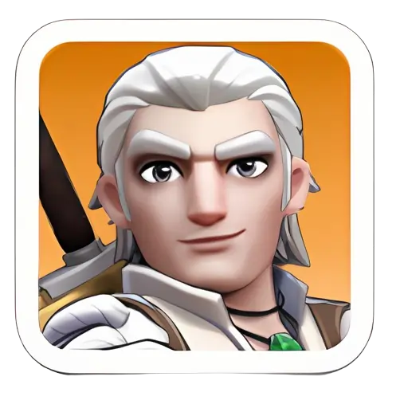 | 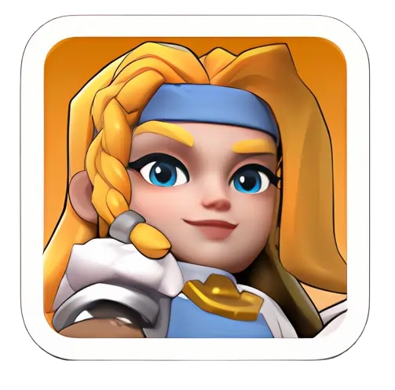 | 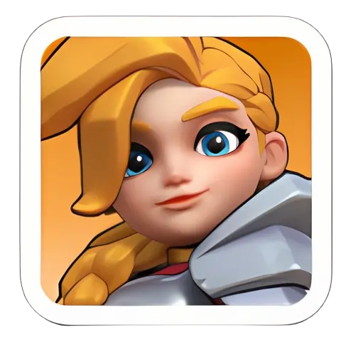 | 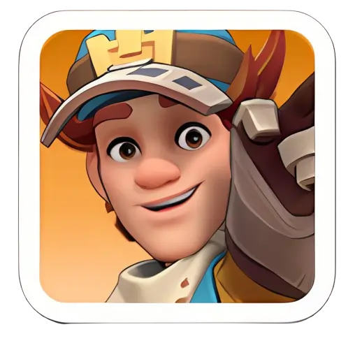 |
|------|------------|------|------------|
| Amadeus    | Helga | Jabel | Saul |

#### Generation 2 / Génération 2
|  | 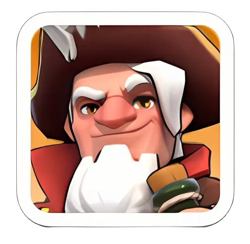 | 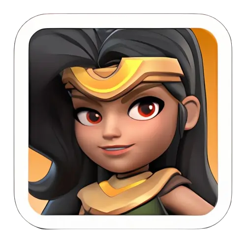 |
|------|------------|------|
| Hilde | Marlin | Zoe |

#### Generation 3 / Génération 3
| 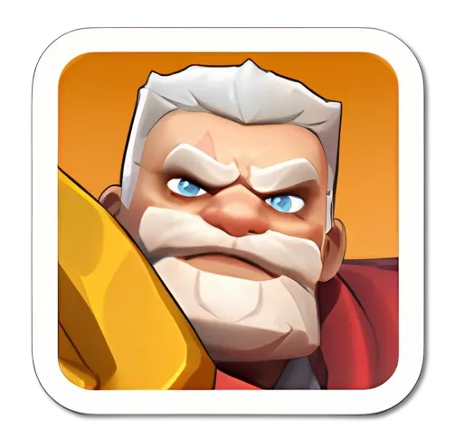 | 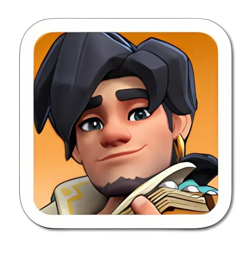 | 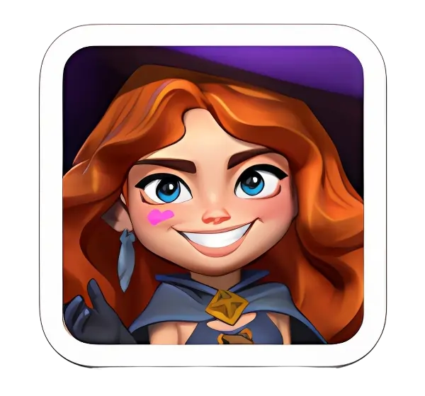 |
|------|------------|------|
| Eric | Jaeger | Petra |

#### Generation 4 / Génération 4
| 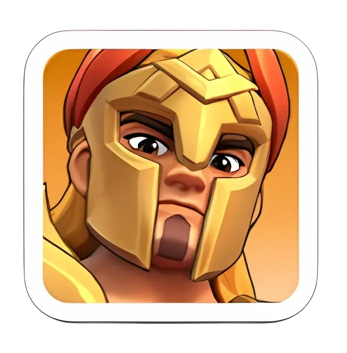 | 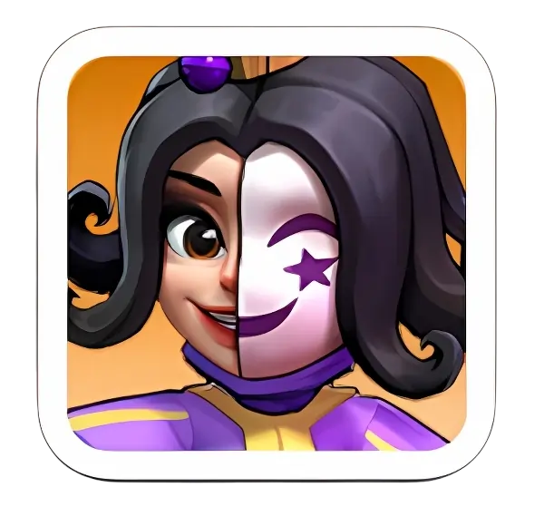 | 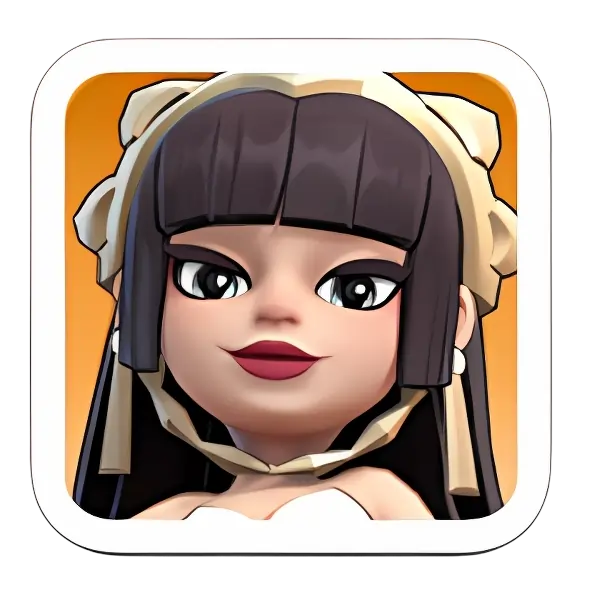 |
|------|------------|------|
| Alcar | Margot | Rosa |

#### Generation 5 / Génération 5
| 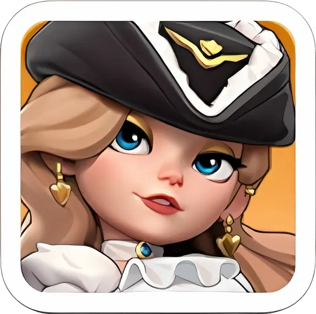 | 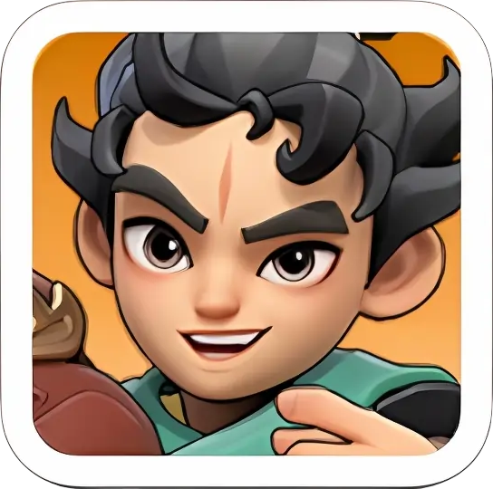 | 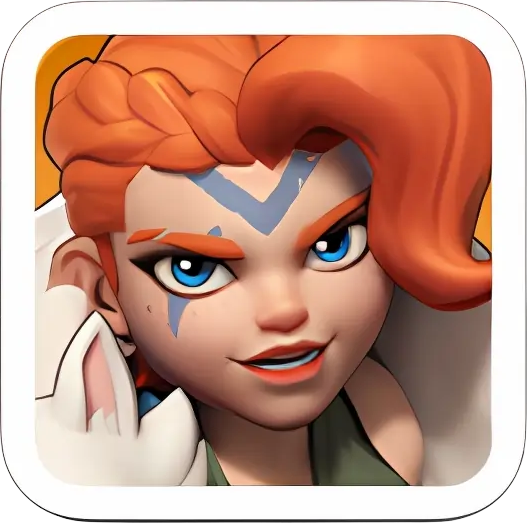 |
|------|------------|------|
| Viviane | Long Fei | Thrud |

#### Generation 6 / Génération 6
| 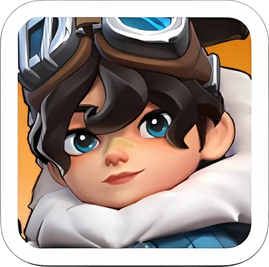 | 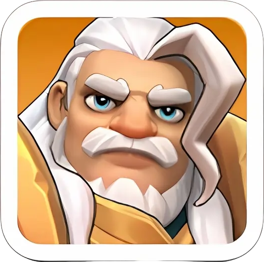 | 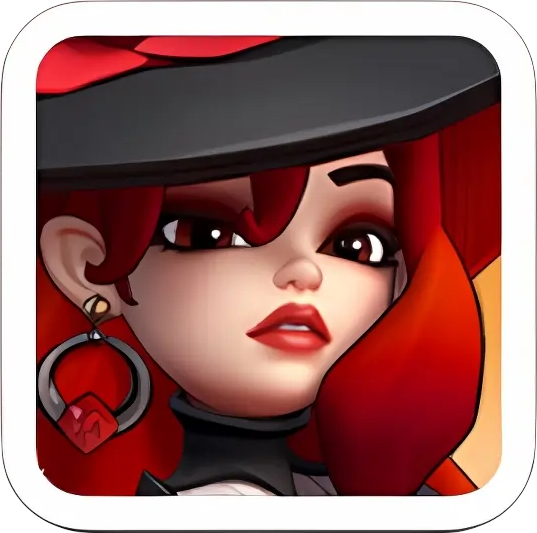 |
|------|------------|------|
| Yang | Triton | Sophia |

#### Generation 7 / Génération 7
| 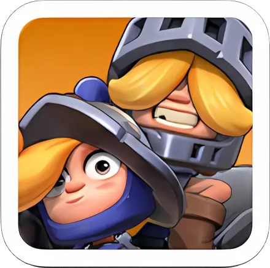 | 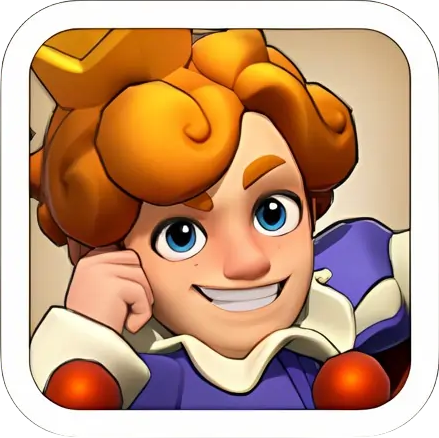 | 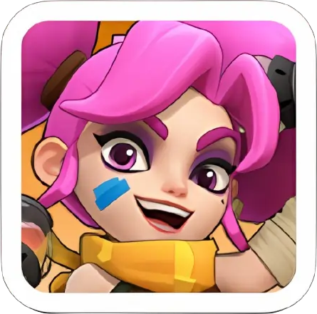 |
|------|------------|------|
| Wee & Woo | Charles | Ava |

#### Epics / Epiques
| 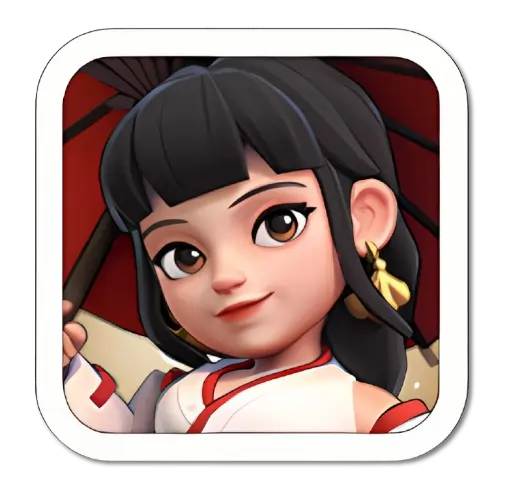 | 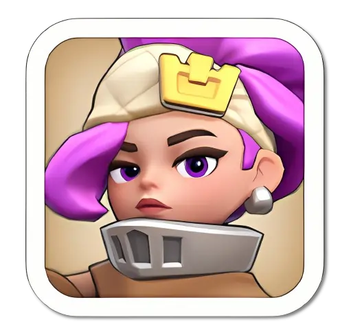 | 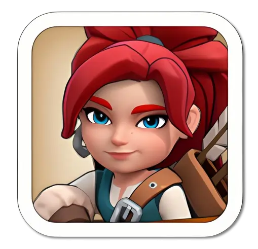 | 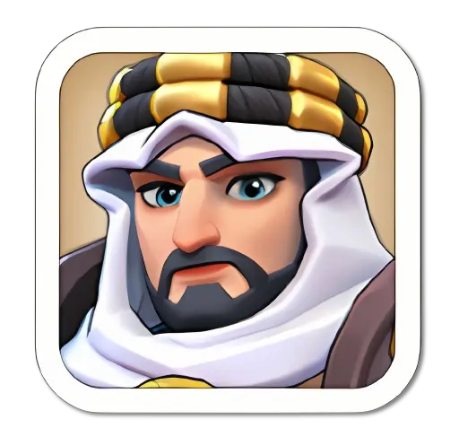 | 
|------|------------|------|------|
| Amane | Chenko | Diana | Fahd | 
| 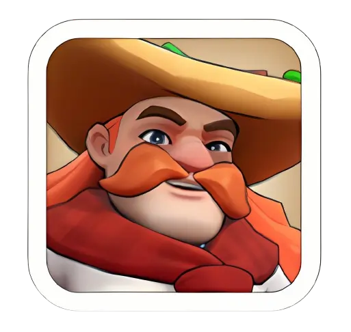 | 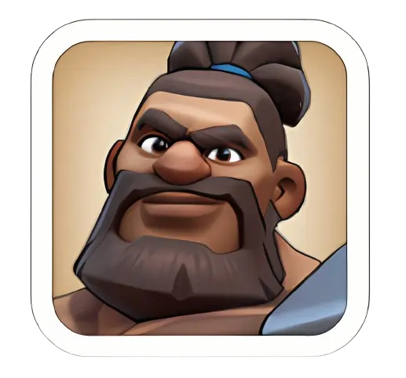 | 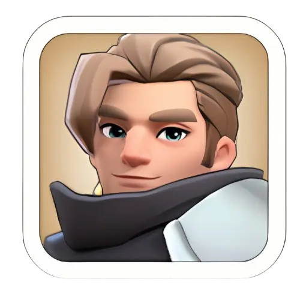 | 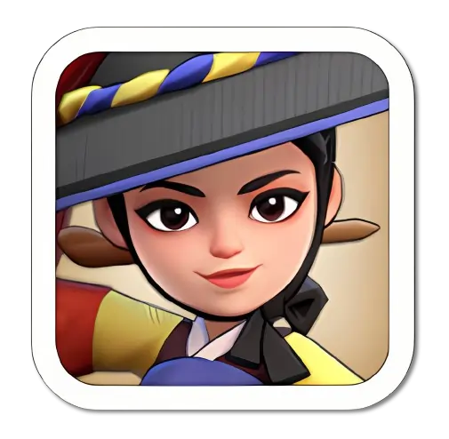
| Gordon | Howard | Quinn | Yeonwoo |

### Easy to get / Facile à obtenir

#### English
These are the heroes you can obtain through the roulette wheel. These are the heroes you can most easily upgrade to 5 stars.

#### Français
Ce sont les héros qu'on peut obtenir grâce à la roulette. Ce sont les héros qu'on peut le plus facilement amener à 5 étoiles.

#### List / Liste
* Saul
* Zoe
* Petra
* Rosa
* Long Fei
* Sophia
* Wee & Woo

### Compare / Comparaison
Note: 
* Without skill / Sans les compétences
* C: Cavalary / cavalier
* I: Infantry / infanterie
* A: Archer

| Heroes | Gen | Type | Attack | Defense | Health/Santé | Bonus attack (%) | Bonus defense (%) |
|------|------------|------|------|------|------|------|------|
| Jabel | 1 | C | 2220 | 2220 | 22200 | 200,16 | 200,16 |
| Amadeus | 1 | I | 2128 | 2200 | 41624 | 260,20 | 260,20 |
| Helga | 1 | I | 1873 | 2220 | 36630 | 200,16 | 200,16 |
| Saul | 1 | A | 2697 | 2220 | 16650 | 200,16 | 200,16 |
| Hilde | 2 | C | 2664 | 2220 | 26640 | 240,19 | 240,19 |
| Zoe | 2 | I | 2043 | 2664 | 39960 | 240,19 | 240,19 |
| Marlin | 2 | A | 3235 | 2220 | 19980 | 240,19 | 240,19 |
| Jeager | 3 | A | 4045 | 3330 | 24974 | 290,23 | 290,23 |
| Eric | 3 | I | 2554 | 3330 | 49950 | 290,23 | 290,23 |
| Petra | 3 | C | 3330 | 3330 | 33300 | 290,23 | 290,23 |
| Rosa | 4 | A | 4989 | 4106 | 30802 | 370,29 | 370,29 |
| Alcar | 4 | I | 3150 | 4106 | 61604 | 370,29 | 370,29 |
| Margot | 4 | C | 4106 | 4106 | 41070 | 370,29 | 370,29 |
| Viviane | 5 | A | 5987 | 4928 | 36962 | 444,35 | 444,35 |
| Long Fei | 5 | I | 3780 | 4928 | 73926 | 444,35 | 444,35 |
| Thrud | 5 | C | 4928 | 4928 | 49284 | 444,35 | 444,35 |
| Yang | 6 | A | 7200 | 5926 | 44454 | 540,43 | 540,43 |
| triton | 6 | I | 4546 | 5926 | 99910 | 540,43 | 540,43 |
| Sophia | 6 | C | 5926 | 5926 | 59274 | 540,43 | 540,43 |
| Wee & Woo | 7 | A | 8656 | 7126 | 53446 | 650,52 | 650,52 |
| Charles | 7 | I | 5466 | 7126 | 106892 | 650,52 | 650,52 |
| Ava | 7 | C | 7126 | 7126 | 71262 | 650,52 | 650,52 |

#### Top 6 attack / attaque
| Heroes | Gen | Type | Attack | Bonus attack (%) |
|------|------------|------|------|------|
| Wee & Woo | 7 | A | 8656 | 650,52 |
| Yang | 6 | A | 7200 | 540,43 |
| Ava | 7 | C | 7126 | 650,52 |
| Viviane | 5 | A | 5987 | 444,35 |
| Sophia | 6 | C | 5926 | 540,43 |
| Charles | 7 | I | 5466 | 650,52 |

#### Top 6 defense / défense
| Heroes | Gen | Type | Defense | Bonus defense (%) |
|------|------------|------|------|------|
| Charles | 7 | I | 7126 | 650,52 |
| Ava | 7 | C | 7126 | 650,52 |
| Wee & Woo | 7 | A | 7126 | 650,52 |
| triton | 6 | I | 5926 | 540,43 |
| Sophia | 6 | C | 5926 | 540,43 |
| Yang | 6 | A | 5926 | 540,43 |

#### Top 6 health / santé
| Heroes | Gen | Type | Health/Santé |
|------|------------|------|------|
| Charles | 7 | I | 106892 |
| triton | 6 | I | 99910 |
| Long Fei | 5 | I | 73926 |
| Ava | 7 | C | 71262 |
| Alcar | 4 | I | 61604 |
| Sophia | 6 | C | 59274 |

### Rating / Classement

#### English
Heroes are classified into 5 tiers. The top tier is S, the next four tiers are A, B, C, and D. D is the weakest.

#### Français
Les héros sont classés selon 5 niveaux. Le top niveau est S, les quatre niveaux suivants sont A, B, C et D. D est le plus faible.

## Best choice for rally attack / Meilleur choix pour l'attaque dans un rassemblement ou rallye

| Tier | Heroes                                      |
|------|---------------------------------------------|
| S    | Amadeus, Petra, Marlin, Rosa                |
| A    | Helga                                       |
| B    | Jabel, Saul, Zoe, Hilde, Eric, Jaeger, Alcar, Margot |
| C    | Quinn, Howard, Chenko, Gordon               |
| D    | Yeonwoo, Amane, Fahd                        |

### English
When you’re launching a rally, the widget expedition skill is the most important. It gives a multiplicative boost to your stats, which means the higher your stats are, the bigger the bonus you’ll get. 
So, the first thing you should check when starting an attack rally is the widget of the hero you’re sending. This is also why heroes with an attack widget are much stronger and rank higher in tier lists.
Amadeus is at the top because he has the best skills in the game, comes with an attack widget, and stays relevant for more than five generations.
Petra is in the same tier since she also has strong skills and an attack widget—plus, she’s the first cavalry hero to get a rally widget. 
Marlin is another good choice because he’s powerful in both the arena and expedition, making him a long-term investment. Rosa is another great archer hero who can replace Marlin in Gen 4.
Helga is placed in A Tier—she’s a good alternative to Amadeus, but her base stats are lower compared to S Tier heroes.
Defender heroes are in B Tier, meaning they’re not the best for attack rallies. Still, in the early generations, you might have no choice but to use them for attacks. Diana and rare heroes aren’t included in the tier list since they don’t have any battle-related skills.

### Français
Lorsque vous lancez un ralliement, la compétence Expédition avec widget est primordiale. Elle multiplie vos statistiques par un bonus : plus vos statistiques sont élevées, plus le bonus est important.

Avant de lancer un ralliement d'attaque, vérifiez d'abord le widget du héros que vous envoyez. C'est pourquoi les héros dotés d'un widget d'attaque sont bien plus puissants et mieux classés dans les listes de niveaux.

Amadeus est au sommet, car il possède les meilleures compétences du jeu, possède un widget d'attaque et reste pertinent pendant plus de cinq générations.

Pétra est au même niveau, car elle possède également de puissantes compétences et un widget d'attaque. De plus, elle est la première héroïne de cavalerie à obtenir un widget de ralliement.

Marlin est un autre bon choix, car il est puissant aussi bien en arène qu'en expédition, ce qui en fait un investissement à long terme. Rosa est un autre excellent héros archer qui pourrait remplacer Marlin en Génération 4.
Helga est placée en Tier A : elle constitue une bonne alternative à Amadeus, mais ses statistiques de base sont inférieures à celles des héros de Tier S.
Les héros défenseurs sont en Tier B, ce qui signifie qu'ils ne sont pas les plus adaptés aux échanges d'attaque. Cependant, dans les premières générations, vous pourriez être contraint de les utiliser pour attaquer. Dianane n'est pas inclus dans la liste des niveaux, car elle ne possèdent aucune compétence de combat.

## Best choice for arena / Meilleur choix pour l'arène

### Generation 1 / Génération 1
#### Basic
| Position | Hero                    |
|----------|-------------------------|
| 1        | Howard, Edwin |
| 2        | Diana, Jabel, Chenko |

#### Dream
| Position | Hero                    |
|----------|-------------------------|
| 1        | Howard, Helga/Amadeus |
| 2        | Diana, Jabel, Chenko |

### Generation 1 & 2 / Génération 1 & 2
#### Basic
| Position | Hero                    |
|----------|-------------------------|
| 1        | Howard, Edwin |
| 2        | Zoe, Jabel, Chenko |

#### Dream
| Position | Hero                    |
|----------|-------------------------|
| 1        | Howard, Helga/Amadeus/Chenko |
| 2        | Zoe, Jabel, Marlin |

### Generation 1 to 3 / Génération 1 à 3
#### Basic
| Position | Hero                    |
|----------|-------------------------|
| 1        | Howard, Petra |
| 2        | Zoe, Jabel, Jaeger |

#### Dream
| Position | Hero                    |
|----------|-------------------------|
| 1        | Howard, Helga/Amadeus |
| 2        | Jaeger, Jabel, Marlin |

### Generation 1 to 4 / Génération 1 à 4
#### Basic
| Position | Hero                    |
|----------|-------------------------|
| 1        | Howard, Petra |
| 2        | Zoe, Rosa, Jaeger |

#### Dream
| Position | Hero                    |
|----------|-------------------------|
| 1        | Margot, Alcar/Amadeus |
| 2        | Jaeger, Rosa, Marlin |

## Best choice for garrison (Defender) / Meilleur choix pour la garnison (Défenseur)
| Tier | Heroes                                      |
|------|---------------------------------------------|
| S    | Jabel, Zoe, Hilde, Eric, Jaeger, Alcar, Margot |
| A    | Saul                                        |
| B    | Amadeus, Petra, Marlin, Rosa, Helga         |
| C    | Quinn, Howard, Chenko, Gordon               |
| D    | Yeonwoo, Amane, Fahd                        |

### English
The defender hero tier list is basically the opposite of the attacker tier list. When picking defender heroes, the main thing to check is whether their widget expedition skill is for defending or attacking.

Right now (up to Gen 4), the best defender heroes are Jabel, Zoe, Hilde, Eric, Jaeger, Alcar, and Margot since they all have defender widgets. Saul is also a good option, but I put him in A Tier because one of his three expedition skills is a growth skill (it boosts construction speed) instead of a battle skill.

Attack heroes go in B Tier for defense. They’re not the best choice for garrison, but they can still work as an alternative. C and D Tier stay the same as the attacker list since those heroes don’t have widgets, so they can’t really be classified as attacker or defender heroes.

### Français
La liste des héros défenseurs est fondamentalement l'inverse de celle des attaquants. Lors du choix des héros défenseurs, il est essentiel de vérifier si leur compétence d'expédition est destinée à la défense ou à l'attaque.

Actuellement (jusqu'à la génération 4), les meilleurs héros défenseurs sont Jabel, Zoé, Hilde, Eric, Jaeger, Alcar et Margot, car ils possèdent tous des compétences de défense. Saul est également une bonne option, mais je le place au niveau A car l'une de ses trois compétences d'expédition est une compétence de croissance (elle augmente la vitesse de construction) plutôt qu'une compétence de combat.

Les héros d'attaque sont au niveau B pour la défense. Ils ne sont pas le meilleur choix pour la garnison, mais peuvent néanmoins constituer une alternative. Les niveaux C et D restent identiques à ceux de la liste des attaquants, car ces héros n'ont pas de compétences ; ils ne peuvent donc pas être classés comme attaquants ou défenseurs.

## Best choice to join / Le meilleur choix pour rejoindre
| Tier | Heroes                                              |
|------|-----------------------------------------------------|
| S    | Chenko, Amane, Yeonwoo, Amadeus, Margot, Hilde|
| A    | Gordon, Quinn, Howard, Eric, Fahd                   |
| B    | Zoe, Marlin, Jaeger, Jabel, Helga, Petra, Rosa, Alcar|

### English
The hero list might look a little strange at first—like why Gordon is only in A Tier while Saul is ranked higher. 
S Tier joiner heroes are the ones you can stack (use four of the same) and still get great results. For example, 4 Sauls give a much bigger defense boost than 4 Gordons. Other strong S Tier joiners include Chenko, Amane, Yeonwoo, Amadeus, Margot, and Hilde—you really can’t go wrong with these.

A Tier joiners are good individually, but you shouldn’t stack four of them since they don’t give as strong of a boost as S Tier. B Tier is where the chance-based skill heroes sit. They can be useful joiners, but only if you use one at a time.

### Français
La liste des héros peut paraître un peu étrange au premier abord, comme par exemple pourquoi Gordon n'est qu'en rang A alors que Saul est mieux classé. Les héros de rang S sont ceux que vous pouvez cumuler (utiliser quatre héros identiques) tout en obtenant d'excellents résultats. Par exemple, 4 Sauls offrent un bonus de défense bien plus important que 4 Gordon. Parmi les autres puissants de rang S, on trouve Chenko, Amane, Yeonwoo, Amadeus, Margot et Hilde : impossible de se tromper avec eux.

Ceux de rang A sont efficaces individuellement, mais il est déconseillé d'en cumuler quatre, car leur bonus est moins important que celui du rang S. Le rang B regroupe les héros à compétences aléatoires. Ils peuvent être utiles, mais seulement si vous n'en utilisez qu'un à la fois.

## Best choice to join a bear hunt rally / meilleur choix pour participer à un rassemblement de chasse à l'ours
| Tier | Heroes                                 |
|------|----------------------------------------|
| S    | Chenko, Amadeus, Yeonwoo, Amane, Margot|
| A    | Hilde                                  |
| B    | Zoe, Marlin, Jaeger, Petra, Rosa       |

### English
Joiner heroes for Bear Hunt are a bit different because the goal is only to boost damage—not health or defense; since the Bear doesn’t deal any damage. In this case, the best joiner heroes are the ones that increase Attack or Lethality.
Hilde is placed in A Tier because her attack boost is lower than the S Tier heroes—she gives a 15% boost while S Tier heroes give 25%. Still, she’s a decent option if you don’t have any of the stronger joiner heroes available.

B Tier heroes can also boost damage, but their skills are chance-based, so they don’t stack well. It’s usually better to use only one of them as a joiner per rally.

Jabel, Saul, Helga, Eric, and Alcar aren’t on the list because their first expedition skill boosts defense, and defense is useless in Bear Hunt.

### Français
Les héros de la Chasse à l'Ours sont un peu différents, car leur objectif est uniquement d'augmenter les dégâts, et non la santé ou la défense ; l'Ours n'infligeant aucun dégât. Dans ce cas, les meilleurs héros de la Chasse à l'Ours sont ceux qui augmentent l'Attaque ou la Létalité.
Hilde est placée en Tier A car son bonus d'attaque est inférieur à celui des héros de Tier S : elle offre un bonus de 15 %, tandis que les héros de Tier S en offrent 25 %. Néanmoins, elle constitue une option intéressante si vous ne disposez pas de héros de la Chasse à l'Ours parmi les plus puissants.

Les héros de Tier B peuvent également augmenter les dégâts, mais leurs compétences sont aléatoires, ce qui les rend difficilement cumulables. Il est généralement préférable d'en utiliser un seul comme joigneur par ralliement.

Jabel, Saul, Helga, Eric et Alcar ne figurent pas sur la liste, car leur première compétence d'expédition augmente la défense, et la défense est inutile dans la Chasse à l'Ours.

## Best choice for boosting building / Meilleur choix pour booster la construction
| Tier | Heroes                                 |
|------|----------------------------------------|
| S    | Saul                                   |

## Best choice to reduce the rally cost / Meilleur choix pour réduire le coût des rassemblements
| Tier | Heroes                                 |
|------|----------------------------------------|
| S    | Diana                                  |

### English
Diana can reduce the cost of gatherings and reconnaissance missions by up to 20%.

### Français
Diana peut réduire le coût des rassemblements et des missions de reconnaissance jusqu'à 20%.

## Best choice by generation / Meilleur choix par génération

Sur quel héros je dois investir et utiliser ? Saul et Diana (encore plus) sont des héros qui sont utiles dans des cas particuliers. Ils ne sont pas à négliger en particulier au début du jeux.

### Generation 1 / Génération 1
* Amadeus
* Helga
* Jabel
* Chenko
* Yeonwoo
* Amane
* Howard
* Quinn
* Saul
* Diana

### Generation 1 & 2 / Génération 1 & 2
* Amadeus
* Marlin
* Zoe
* Jabel
* Chenko
* Yeonwoo
* Amane
* Howard
* Quinn
* Saul

### Generation 1 to 3 / Génération 1 à 3
* Amadeus
* Petra
* Marlin
* Zoe
* Jabel
* Chenko
* Yeonwoo
* Amane
* Howard

### Generation 1 to 4 / Génération 1 à 4
* Amadeus
* Petra
* Rosa
* Margot
* Marlin
* Zoe
* Alcar
* Jabel
* Chenko
* Yeonwoo
* Howard

## Starts cost / Coût des étoiles
### English
Each hero's level progresses up to a 5-star level. You need fragments of that hero to evolve them.
To reach the first star, you'll need 10 fragments, but to reach the fifth, you'll need a total of 1,065.

### Français
Le niveau de chaque héros évolue jusqu'à 5 étoile. Vous avez besoin de fragments du héros concerné pour le faire évoluer.
Pour obtenir la première étoile vous aurez besoin de 10 fragments mais pour arriver à la cinquième, il en faudra au total: 1065.

### Start => fragments / Etoile => Fragments
* 1: 10
* 2: 10 + 40 => 50
* 3: 10 + 40 + 115 => 165
* 4: 10 + 40 + 115 + 300 => 465
* 5: 10 + 40 + 115 + 300 + 600 => 1065

   

